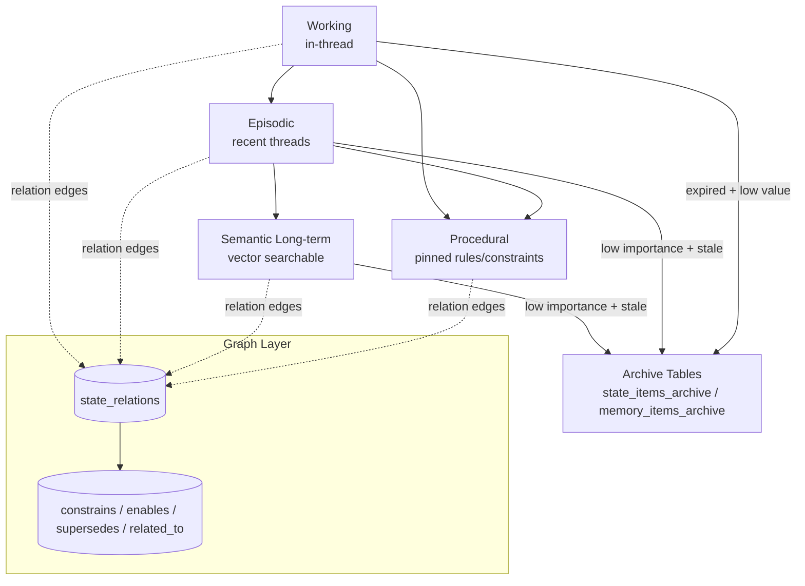

# Memory Roadmap

## Purpose

This document unifies the structured memory implementation plan with the autonomous evolution vision. It is the execution reference for multi-tier memory, adaptive forgetting, governance, and graph-aware retrieval.

## Importance Score Calculation

Jarvis computes an `importance_score` in `[0.0, 1.0]` for each state item:

```python
importance = (
    0.4 * recency_score
    + 0.3 * access_count_norm
    + 0.2 * llm_self_assess
    + 0.1 * user_feedback
)
importance = min(1.0, max(0.0, importance))
```

Component definitions:
- `recency_score`: exponential decay based on `last_seen_at` (newer -> closer to `1.0`).
- `access_count_norm`: normalized `access_count` using capped log scaling to `[0,1]`.
- `llm_self_assess`: extractor confidence scalar (`low=0.3`, `medium=0.6`, `high=0.9`) or one-line assessor output in `[0,1]`.
- `user_feedback`: explicit signal (`+1` helpful, `0` neutral, `-1` wrong) mapped to `[0,1]`.

Implementation notes:
- Compute during extraction/upsert and maintenance sweeps.
- Store in `state_items.importance_score`.
- Use for tier migration and archive decisions.

## Memory Tier and Archive Flow



## Delivery Order

1. Core schema and model additions.
2. Tier migration and adaptive archival tasks.
3. Failure capsule bridge and review queue.
4. Hybrid retrieval and graph traversal APIs.
5. UI/CLI review and export surfaces.
6. Metrics and consistency evaluator.
